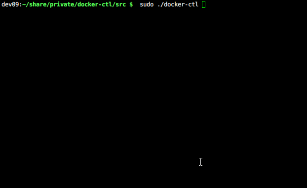

# A control tool for Docker

## 依赖安装
- *readline*

## 启动工具
- `sh docker-ctl` or `sudo sh docker-ctl`

## 常用命令

### **docker command**
- `images`
- `ps`
- `run`
- ...
- 扩展命令
- - `select 18888165ff42` # select container
- - `history [--clear]` # show history or clear all history
- - `clear` # clear all the words on screen
- - `exit [--all]` # exit current container or docker-ctl
### **container command**
- `ls`
- `top`
- `ps`
- `tail`
- ...
- 扩展命令
- - `alias`

